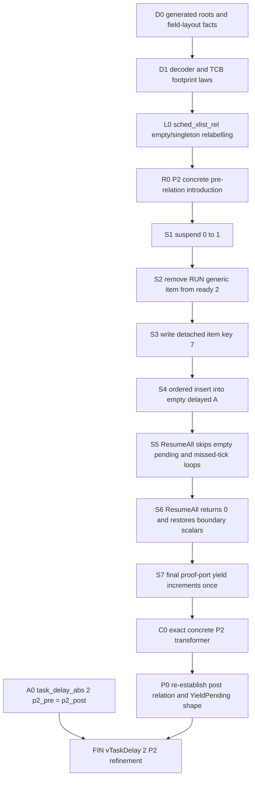

# Scheduler raw relation and P2 refinement plan

Status: `STATIC_DESIGN_ONLY__NO_ISABELLE_RUN`

This note freezes a first implementation plan for a concrete-to-abstract scheduler
representation relation and a restricted positive `vTaskDelay` refinement theorem.
It is based only on the local FreeRTOS V6.1.1 source, generated translation/type
information, the independently designed abstract scheduler model, the existing raw
list relation, and the P2/P3 execution trace.  No original scheduler formalisation
was consulted.

No theorem, session, `ROOT` entry, or build result is claimed here.  Isabelle-style
snippets below are design sketches; in particular, names for generated addresses of
file-static arrays/objects must be read from the generated C environment before they
are committed to a theory.

## 1. Frozen evidence and claim boundary

The evidence set for this design is:

| Evidence | SHA-256 |
|---|---|
| `upstream/FreeRTOSV6.1.1/Source/tasks.c` | `0A5B6C12AEA6FAE2A951C0E80BDC301C646EF8C6360D574A2C4699D4C33A45BF` |
| `proof_port/scheduler/FreeRTOSConfig.h` | `D9F50714A1137703ACEEB884329ACAEBCFCBF713DAB594F6CE5A0E74E4D5952A` |
| `theories/scheduler_abs_model/Scheduler_Abstract_Model.thy` | `FE22AA8F2850CDCD777D89E1D6CD3880DCD9D9524A75DCACF97B46839B98D1DE` |
| `theories/list_raw_r5_relation/List_V611_Raw_R5_Relation.thy` | `5CD5EF0B3850FEBD712664EA375ED04E3BDDD2C8B80B9AEA75EBDF006613A199` |
| `theories/scheduler_delay/Scheduler_V611_Delay_Translation.thy` | `D34512E4642779C49BF412E7FF05E4FB622EF47E255F152AA1CB765E7EA89A68` |
| `runs/20260731Tscheduler-trace-03-delay-phases/trace.jsonl` | `125A7B9F605DC41C894EEB39D4AED3A128963FF05A6C1758E7A5CEF45EC099A8` |

The first relation is deliberately parameterised by a decoder `D` and a physical
root environment `R`:

```isabelle
raw_scheduler_rel D R c a
```

The top-level invariant is `core_wf a`, not `settled_wf a`.  This is necessary for
the observed P2 post-state: after the final proof-port yield request, the concrete
`pxCurrentTCB` still denotes `RUN`, although `RUN` has moved from ready priority 2
to the current delayed list, and `uxTopReadyPriority` is still 2 although ready
priority 2 is empty.  Both facts are valid at this API boundary.

An optional phase-indexed endpoint predicate should carry the stronger transient
facts:

```isabelle
datatype scheduler_phase = StableRunning | YieldPending

scheduler_endpoint_rel StableRunning D R c a =
  (raw_scheduler_rel D R c a \<and> settled_wf a \<and> ...)

scheduler_endpoint_rel YieldPending D R c a =
  (raw_scheduler_rel D R c a \<and> p2_yield_pending_shape c a \<or> ...)
```

The actual definition should avoid the schematic precedence above by using named
predicates.  The important design point is that phase is a theorem index or ghost
observation, not something inferred merely from the numerical yield counter.

Further frozen choices are:

* the configured ready domain is exactly the four priorities `0..<4`;
* `sa_delayed_a` and `sa_delayed_b` describe the two physical list objects;
* `sa_current_role_a` describes which physical delayed object currently has the
  semantic current-delayed role;
* `pxCurrentTCB` represents the selected task and is not required to be ready at
  every function boundary;
* `sa_top_ready` equals the concrete cache, but `ready_cache_wf` only requires the
  cache to be a sound upper bound with a non-empty ready list below it;
* the first positive-delay theorem is the exact, non-wrapping, two-task P2 case.  It
  is not a theorem for arbitrary ready or delayed rings and not yet the P3 wrap case.

## 2. Task and node decoder

The source embeds two `xLIST_ITEM_C` objects in each translated
`tskTaskControlBlock_C`: `xGenericListItem_C` and `xEventListItem_C`.  The abstract
model deliberately distinguishes them:

```isabelle
datatype 'tid node_kind = Generic 'tid | Event 'tid
```

A decoder environment should therefore contain at least a live-task encoding and
its partial inverse:

```isabelle
record 'tid scheduler_decode =
  tcb_ptr    :: "'tid \<Rightarrow> tskTaskControlBlock_C ptr"
  tcb_decode :: "tskTaskControlBlock_C ptr \<Rightarrow> 'tid option"

definition generic_item_ptr where
  "generic_item_ptr tp =
     PTR(xLIST_ITEM_C) &(tp\<rightarrow>[''xGenericListItem_C''])"

definition event_item_ptr where
  "event_item_ptr tp =
     PTR(xLIST_ITEM_C) &(tp\<rightarrow>[''xEventListItem_C''])"

definition node_ptr where
  "node_ptr D (Generic t) = generic_item_ptr (tcb_ptr D t)"
| "node_ptr D (Event t)   = event_item_ptr   (tcb_ptr D t)"

definition node_decode where
  "node_decode D p =
     (if (\<exists>t. tcb_decode D (tcb_ptr D t) = Some t \<and>
              p = generic_item_ptr (tcb_ptr D t))
      then Some (Generic (THE t. ...))
      else if ... then Some (Event (THE t. ...)) else None)"
```

The last definition is only illustrative.  The implementation should not use
`THE`.  Prefer a decoder supplied as a field, or define a finite graph and prove
functionality before using `SOME`.  The usable interface is a collection of exact
laws over `sa_live a`:

1. `tcb_decode D (tcb_ptr D t) = Some t` for every live `t`;
2. `tcb_ptr D` is injective on live tasks;
3. `node_decode D (node_ptr D n) = Some n` for every live node `n`;
4. if `node_decode D p = Some n`, then `n` belongs to a live task and
   `p = node_ptr D n`;
5. all live generic/event node pointers are pairwise distinct, including
   `generic_item_ptr tp \<noteq> event_item_ptr tp` for the same TCB;
6. decoder nodes are distinct from every scheduler list root and mini-list
   sentinel address;
7. both embedded items have `pvOwner` equal to the enclosing TCB pointer (with the
   generated pointer coercion made explicit);
8. the TCB field `uxPriority_C` equals `of_nat (sa_priority a t)` and satisfies the
   generated word bound.

`pvOwner` cannot itself determine `Generic` versus `Event`: both items owned by one
task store the same TCB address.  The decoder must use the embedded-field address.
The exact generated field-layout lemma names, pointer coercions, and array-address
terms must be confirmed with `print_statement`/PIDE before the definitions are
written; this plan intentionally does not invent them.

## 3. Physical root environment and delayed roles

Keep physical identity separate from semantic role:

```isabelle
record scheduler_roots =
  ready_root     :: "nat \<Rightarrow> xLIST_C ptr"
  delayed1_root  :: "xLIST_C ptr"
  delayed2_root  :: "xLIST_C ptr"
  pending_root   :: "xLIST_C ptr"
  suspended_root :: "xLIST_C ptr"
```

`ready_root R p` for `p<4` must be derived from element `p` of the translated
file-static `xLIST_C[4]` ready array.  The two delayed roots, pending-ready root, and
suspended root likewise denote the translated physical objects in the raw heap.
They should not be confused with globals that merely point at those objects.  In
particular, the generated state has explicit `pxDelayedTaskList_'` and
`pxOverflowDelayedTaskList_'` role pointers.

The physical-list layer relates exactly eight roots:

```isabelle
(\<forall>p<4. sched_xlist_rel D h (ready_root R p) (sa_ready a p))
\<and> sched_xlist_rel D h (delayed1_root R) (sa_delayed_a a)
\<and> sched_xlist_rel D h (delayed2_root R) (sa_delayed_b a)
\<and> sched_xlist_rel D h (pending_root R) (sa_pending a)
\<and> sched_xlist_rel D h (suspended_root R) (sa_suspended a)
```

Role pointers are then exact:

```isabelle
pxDelayedTaskList_' c =
  (if sa_current_role_a a then delayed1_root R else delayed2_root R)

pxOverflowDelayedTaskList_' c =
  (if sa_current_role_a a then delayed2_root R else delayed1_root R)
```

The P2 and P3 traces do not swap these pointers.  P2 inserts wake time 7 into
physical delayed list 1; P3 inserts wrapped wake time 1 into physical delayed list
2.  A later tick-overflow theorem, not `vTaskDelay` itself, will establish the role
swap and increment `sa_overflows`.

## 4. Relabelling `raw_xlist_rel`

`raw_xlist_rel h lp rx` already gives the difficult local raw-list facts, but its
abstract node identifiers are raw `xLIST_ITEM_C ptr` values.  Scheduler rings use
`node_kind`.  Add one thin relabelling bridge rather than cloning the raw relation:

```isabelle
definition xlist_relabel where
  "xlist_relabel D rx q \<longleftrightarrow>
     list_all2 (\<lambda>p n. node_decode D p = Some n)
       (ring rx) (ring q)
   \<and> rel_option (\<lambda>p n. node_decode D p = Some n)
       (cursor rx) (cursor q)
   \<and> (\<forall>p n. node_decode D p = Some n \<longrightarrow>
          p \<in> set (ring rx) \<longrightarrow> live_key rx p = live_key q n)"

definition sched_xlist_rel where
  "sched_xlist_rel D h lp q \<longleftrightarrow>
     (\<exists>rx. raw_xlist_rel h lp rx \<and> xlist_relabel D rx q)"
```

The real record-selector names may differ.  The bridge must nevertheless preserve
all three observables: circular order, cursor, and each live node's key.  It must
use `list_all2`/`rel_option` or an equivalent functional graph, never a partial
`the (node_decode ...)` expression.

### Reused without duplication

The scheduler relation should reuse `raw_xlist_rel` for:

* guards for the list object, its mini-list end, and every member item;
* the concrete count/list-length equation;
* cursor representation;
* forward/backward circular links, including the sentinel cases;
* item-value/live-key correspondence;
* each member's `pvContainer` pointer;
* the relation's existing local list/member and member/member separation facts.

The mini-list end is a prefix-sized sentinel, not a full `xLIST_ITEM_C`.  No
scheduler-level footprint lemma may strengthen its allocation to a full item.

### Scheduler-level facts that must still be quantified

`raw_xlist_rel` is local to one root.  The following are separate obligations:

* pairwise disjoint physical `xLIST_C` root regions for the eight roots;
* `c_guard` for every live full TCB, and pairwise disjoint full TCB regions for
  distinct tasks;
* separation of every scheduler root region from every live TCB region;
* the generated containment facts saying the generic/event item regions are
  subregions of their TCB, plus their within-TCB non-overlap;
* cross-list uniqueness: no decoded node belongs to two scheduler-owned roots;
* decoder closure: every member of the eight scheduler roots decodes to the
  permitted `node_kind` of a live task;
* TCB owner and priority field equations;
* placement/container facts for embedded nodes not currently in one of the eight
  rings;
* role-pointer, current-pointer, cache, task-count, and scalar equations;
* any heap/global frame needed for objects outside the relation footprint.

Do not require an embedded item region to be disjoint from its enclosing TCB; it is
a subobject.  The useful global proof route is: distinct full TCB regions are
disjoint; list-root regions are disjoint from full TCB regions; within one TCB the
two item fields are disjoint.  From these facts derive the cross-root item
separation needed by each list operation.

For generic nodes, the scheduler-owned placement is exact: each live task's generic
item occurs in exactly one of the ready, physical delayed, or suspended roots at
the endpoints in scope.  Pending-ready contains only `Event` nodes; ready, delayed,
and suspended roots contain only `Generic` nodes.

For event nodes, avoid a false global NULL claim.  If `Event t` is in pending-ready,
its container is the pending root.  If it is absent and `sa_event_waiting a t` is
false, its container is NULL.  If `sa_event_waiting a t` is true, an external event
list owns it and that root/footprint must be supplied by a future environment
relation.  P2 has no event waiters, so both event items are detached with NULL
containers there.

## 5. Layered scheduler relation

Use named layers so failures localise before the final refinement composition:

```text
raw_scheduler_rel D R c a
  = core_wf a
  + root_layout_rel R c
  + tcb_decode_rel D R (hrs_mem (t_hrs_' c)) a
  + scheduler_lists_rel D R (hrs_mem (t_hrs_' c)) a
  + scheduler_membership_rel D R c a
  + scheduler_scalar_rel D R c a
  + scheduler_boundary_rel c
```

The intended responsibilities are:

1. **Root/layout layer.** Bind the schematic roots to the generated physical
   addresses; prove the root guards and pairwise separation once.
2. **Decoder/TCB layer.** Full TCB guards, live-task bijection, embedded-field
   addresses, node decoder laws, `pvOwner`, and priority.
3. **List layer.** The eight `sched_xlist_rel` conjuncts and role restrictions on
   their decoded members.
4. **Membership/role layer.** Exact generic placement, pending/event status,
   delayed physical-versus-semantic role, wake-key agreement, and detached
   containers.
5. **Scalar/boundary layer.** Current task, tick and suspension counters, cache,
   task count, overflow/yield counters, and proof-port boundary state.

`scheduler_scalar_rel` should reuse the existing scalar projection where possible:

* `xTickCount_' c = sa_tick a`;
* `uxSchedulerSuspended_' c = of_nat (sa_suspend_depth a)`;
* `uxMissedTicks_' c = sa_missed_ticks a`;
* `xMissedYield_' c` is the concrete encoding of `sa_missed_yield a`;
* `uxTopReadyPriority_' c = of_nat (sa_top_ready a)`;
* the proof-port yield counter equals `sa_yield_count a` under its no-wrap bound;
* `xNumOfOverflows_' c = sa_overflows a`, with the exact signed/unsigned
  conversion and range side-condition exposed rather than hidden by `simp`;
* `uxCurrentNumberOfTasks_' c = of_nat (card (sa_live a))`, with the word bound;
* `pxCurrentTCB_' c` is NULL iff `sa_current a=None`, and otherwise equals
  `tcb_ptr D t` for `Some t`.

At quiescent API entry/exit, additionally require the configured scheduler-running
flag to be 1, proof-port critical depth to be 0, and interrupts to be enabled.  The
running flag has no abstract field and belongs in `scheduler_boundary_rel`, not in
the mathematical transition.  A theorem that cuts inside `vTaskDelay` should use a
weaker internal boundary predicate instead of pretending these endpoint conditions
hold throughout.

Heap cells and globals outside the owned roots, live TCBs, role/scalar globals, and
proof-port state should be described by an explicit frame predicate in operational
lemmas.  They need not pollute the pure abstract model.

## 6. Restricted two-task, empty-delayed P2 preimage

Introduce a two-element task type (schematically `IDLE | RUN`) and closed pure
states `p2_pre` and `p2_post`.

`p2_pre` has exactly:

* live tasks `{IDLE, RUN}` with priorities 0 and 2;
* ready 0 = singleton `Generic IDLE`, ready 2 = singleton `Generic RUN`, and ready
  1/3 empty; all ready item keys are 0;
* both physical delayed rings, pending-ready, and suspended rings empty;
* delayed physical A is the current role;
* current task `Some RUN`, tick 5, top-ready cache 2;
* no wake times and no event waiters;
* suspend depth, missed ticks, missed yield, overflow count, and yield count all 0.

`p2_post` differs exactly as follows:

* ready 2 becomes empty;
* physical delayed A becomes singleton `Generic RUN` with key 7;
* `sa_wake RUN = Some 7`;
* current remains `Some RUN` and the top-ready cache remains 2;
* the yield count becomes 1.

All other abstract fields, including tick 5, delayed-role selection, ready 0,
physical delayed B, pending-ready, suspended, overflow count, and event-waiting
flags remain unchanged.

The first pure checks are independent of the C heap:

```isabelle
lemma task_delay_abs_2_p2:
  "task_delay_abs 2 p2_pre = p2_post"

lemma p2_pre_settled:
  "settled_wf p2_pre"

lemma p2_post_core:
  "core_wf p2_post"

lemma p2_post_not_settled:
  "\<not> settled_wf p2_post"
```

The last statement should be proved from the precise current/cache clauses; if
`settled_wf` later changes, retain separate explicit lemmas saying `RUN` is not
ready and ready priority 2 is empty.

Next, prove an introduction rule for the concrete preimage from explicit generated
root/layout, two TCB, singleton-list, empty-list, pointer, and scalar assumptions:

```isabelle
lemma raw_scheduler_rel_p2I:
  assumes p2_generated_root_layout R c
      and p2_tcb_layout D R c
      and p2_eight_list_shapes D R c
      and p2_scalar_shape D R c
  shows "scheduler_endpoint_rel StableRunning D R c p2_pre"
```

`p2_eight_list_shapes` should be assembled from
`raw_xlist_rel_emptyI`/`raw_xlist_rel_singletonI` plus small relabelling lemmas,
not by unfolding raw circular-list representation in the scheduler proof.

This assumption-driven introduction theorem is useful, but it is not by itself a
non-vacuity result.  The honest two-stage milestone is:

1. check `raw_scheduler_rel_p2I` under explicit raw heap/layout assumptions;
2. later construct one fixed finite heap/global state satisfying those assumptions
   and prove `\<exists>D R c. scheduler_endpoint_rel StableRunning D R c p2_pre`.

Only stage 2 closes the concrete preimage existence claim.  It must allocate full
TCBs, use the mini-list sentinel layout correctly, initialise both embedded owners
and all eight list roots, and establish all pointer guards/disjointness.  Until then,
reports must say “conditional P2 preimage introduction”, not “P2 witness exists”.

## 7. Positive `vTaskDelay 2` lemma graph

The restricted proof should follow the C phase structure and expose a checked
state after each phase.  The proposed dependency graph is:



The operational lemmas should be split as follows.

1. **Suspend.** From depth 0, `vTaskSuspendAll` changes only the suspension depth to
   1 and preserves the eight roots, TCB fields, role pointers, tick, and port state.
2. **Ready removal.** Instantiate the existing general raw removal theorem at the
   singleton ready-2 ring.  Derive the needed cross-list/frame conditions from the
   scheduler footprint.  The result is an empty ready-2 ring and a detached RUN
   generic item; top cache is deliberately unchanged.
3. **Wake-key write.** Prove unsigned arithmetic `5 + 2 = 7`, no wrap
   (`7 \<ge> 5`), and an exact heap update of the detached item's value to 7.  Show
   all link/owner/TCB fields and unrelated roots are framed.
4. **Delayed insertion.** Use the special empty-to-singleton refinement theorem for
   source `vListInsert`, because `vTaskDelay` calls ordered insertion, not
   `vListInsertEnd`.  Its post-state is physical delayed A singleton RUN, key 7,
   with the item container equal to delayed A.
5. **ResumeAll guards.** From empty pending-ready, prove its loop guard is false.
   From missed ticks 0, prove the missed-tick replay loop is skipped.  From missed
   yield false, prove no internal yield branch is taken.
6. **ResumeAll result.** Establish suspension 1 to 0, critical depth 0 on return,
   interrupts enabled, return value 0, no counter wrap, and no change to the
   scheduler rings beyond the earlier removal/insertion.
7. **Final yield.** Because ResumeAll returned 0, the explicit port yield executes
   exactly once.  Prove yield count 0 to 1 under the concrete counter's no-wrap
   side-condition and frame every scheduler heap cell.
8. **Composition.** Compose the exact phase transformers before asking automation
   to prove the relational postcondition.
9. **Post relation.** Reuse relabelled empty/singleton rules; re-establish decoder,
   owner and priority frames; show all six untouched roots are unchanged; discharge
   scalar equations and `core_wf p2_post`; add the explicit YieldPending shape.

The target theorem is schematically:

```isabelle
theorem vTaskDelay_2_p2_refines:
  assumes "scheduler_endpoint_rel StableRunning D R c p2_pre"
      and p2_fixed_layout_assumptions D R c
      and scheduler_yield_count_no_wrap c
  shows "vTaskDelay' 2 \<bullet> c
    {\<lambda>r t. r = Result () \<and>
            raw_scheduler_rel D R t (task_delay_abs 2 p2_pre) \<and>
            p2_yield_pending_shape D R t p2_post}"
```

The exact AutoCorres Hoare/result syntax must follow the translated theorem, not
this sketch.  The claim is only the concrete P2 instance.  It does not quantify an
arbitrary abstract state and it does not claim refinement of positive delays in
general.

## 8. Checker order and anti-monolith rules

The first checker targets, each with a bounded build, should be:

1. generated names and root-address `print_statement` checks;
2. pure `p2_pre`/`p2_post` definitions and the four pure P2 lemmas;
3. decoder inverse/injectivity laws for two fixed TCBs;
4. `xlist_relabel` identity, empty, and singleton lemmas;
5. `sched_xlist_rel` empty/singleton introduction and elimination lemmas;
6. the eight-root `p2_eight_list_shapes` bundle;
7. conditional `raw_scheduler_rel_p2I`;
8. removal plus scheduler cross-frame at ready 2;
9. detached key-write plus ordered empty insertion at delayed A;
10. ResumeAll guard/result lemmas, final yield, exact composition, then the final
    relational theorem.

If a target grows beyond a small local state delta, introduce the missing footprint
or phase predicate instead of unfolding the entire relation.  A single monolithic
`vTaskDelay` proof should not be attempted before targets 1--9 are green.

The following adversarial checks guard against attractive but false formulations:

* construct the P2 post-state to refute “current must always be in a ready ring”;
* construct the P2 post-state to refute “top-ready cache is always the exact highest
  non-empty priority”;
* use P3 (`tick = UINT32_MAX-1`, delay 3, wake 1) to refute “positive delay always
  inserts into physical delayed A”;
* use one TCB's two embedded items to refute decoding based on `pvOwner` alone;
* use an event-waiting task to refute “every event item absent from pending has NULL
  container”;
* keep role pointers unchanged in P2/P3 to refute conflating physical insertion
  choice with delayed-role swapping;
* reject any preimage claim whose only evidence is an implication from inconsistent
  pointer/guard assumptions.

## 9. Extension path after P2

The next narrow theorem is P3.  It reuses the relation and most of the phase graph,
but proves modular wake arithmetic and selects physical delayed B while leaving both
role pointers unchanged.

A genuinely general positive-delay refinement needs additional work:

* general ordered insertion into a non-empty delayed ring, including equal-key
  policy and cursor preservation;
* general removal from non-singleton ready rings;
* cache/current reasoning for arbitrary scheduler phases;
* pending-ready replay, missed-tick replay, and missed-yield branches of
  `xTaskResumeAll`;
* an external-event-list environment for `sa_event_waiting` tasks;
* tick-overflow role swapping and overflow-counter conversion;
* an explicit concrete preimage family, not just one P2 witness.

Those extensions should be added only after the P2 theorem has demonstrated that
the decoder, eight-root footprint, role-pointer split, and phase-indexed invariant
are independently checkable.
